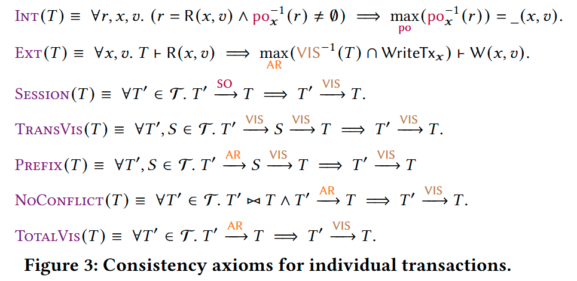
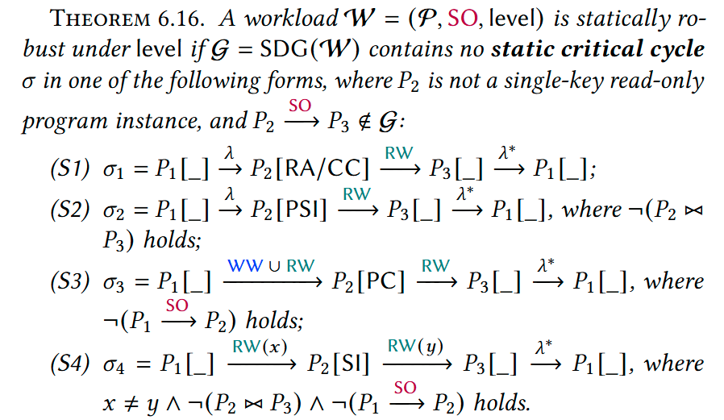
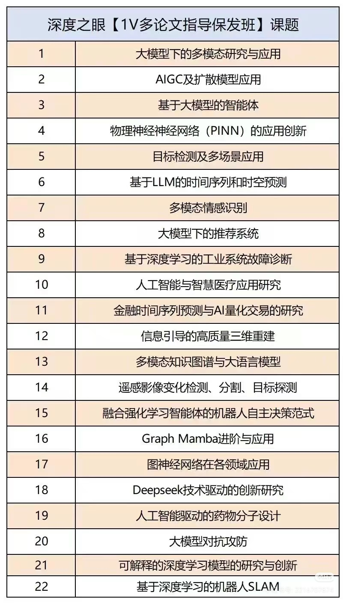

<!-- _class: cover_e -->
<!-- _paginate: "" -->
<!-- _footer:  -->

# 做难而正确的事

###### 细分方向和课题选择

熊丘桓
2026 年 02 月 23 日
<qiuhuanxiong@smail.nju.edu.cn>

## 目录

<!-- _class: cols1_ol_sq fglass toc_a -->
<!-- _footer: "" -->
<!-- _header: "CONTENTS" -->
<!-- _paginate: "" -->

- 研究范式决定研究者兴趣
- 研究范式决定研究意义感
- AI 时代，科研工作者能做些什么

### 大一阶段参与早期科研的意义

<!-- _class: cols-2-64 -->

- 在导师的英明领导下，产出颠覆性的学术成果 ×
- 知道自己几斤几两，以决定是否要读博并从事学术研究 √
- 混一个论文署名，在就业升学过程中获得更大竞争优势 ？

### 为什么要选题

<!-- _class: bq-green -->

选题不是导师给我的吗？

是也不是。

> 一个典型的研究过程
>
> 导师：你读一下这几篇文献，我们来把 A 方法应用到 B 领域中。
> 学生读完之后：我觉得 A 方法不适用于 B 领域，但是我认为 A 方法可能可以解决目前困扰 C 领域的一个问题，我来写个研究方案。
> 几周后，学生：A 方法能够显著解决 C 领域的某问题，性能提高了 xxx/成本降低了 xxx/填补了 xxx 的空白。

### 选择细分方向要参考平台资源

<!-- _class: cols-2-64 -->

CSRanking(<https://csrankings.org/>) 是一个完全客观的、按照计算机学科顶会论文数量对学术机构进行排名的数据库。

在该数据库中，选取 2016-2026 的数据，南京大学在 AI 领域的五个子领域中：

- Artificial intelligence 排名世界第 1
- Computer vision 排名世界第 9
- Machine learning 排名世界第 4
- Natural language processing 排名世界第 12
- The Web & information retrieval 排名世界第 13

其他学科暂无细分方向的客观排名，可以在社交媒体

<!-- 
Artificial intelligence 领域世界排名
 -->

<!--  -->

<!-- 
Software engineering 领域世界排名
 -->

## 研究范式决定研究者兴趣

<!-- _class: trans -->

### 研究范式

研究范式（research paradigm）是指在某一学科或研究共同体中，被广泛接受的一整套关于：

- 研究对象是什么
- 什么问题是“值得研究的”
- 什么方法是“合法的”
- 什么结果算作“知识”
- 如何评价研究质量

的基本假设、方法体系与价值标准的集合。

例如，自然科学通过控制变量等手段，在特定实验环境下进行可复现的实验，研究自变量和因变量的关系；而宏观经济学通过研究历史经济数据，利用统计学模型获得变量间的相关性，并通过适当的经济学理论推断变量间的因果关系。

### 同一学科内不同细分方向的研究范式大相径庭

以智能科学与技术四个典型细分方向为例：

- **机器学习**：经验主义与工程驱动，强调数据规模与算法创新
- **知识表示与推理**：形式化与逻辑主义，追求理论严密性与可证明性
- **类脑智能**：跨自然科学范式，融合神经生物学与计算模型
- **人机交互**：社会科学与心理学范式，重视用户体验与实验设计

这些范式在**研究方法、验证标准、成果评价和人才特质要求**上差异巨大。

### 机器学习方向：经验主义与工程驱动范式

- 研究对象：大规模数据集与统计模型
- 核心问题：如何在数据上获得更低的 error、更高的 accuracy、更好的 generalization
- 方法论（Methodology）：
    - 数学建模（概率论、优化理论、信息论）
    - 算法设计（SGD、Transformer、Diffusion Model 等）
    - 大规模实验对比（benchmark 驱动）
- 实验范式：
    - 标准数据集（ImageNet、COCO、GLUE 等）
    - 可复现实验
    - 定量指标（Accuracy、F1、BLEU、Perplexity）
    - 成果评价标准：
        - 是否在 benchmark 上超过 SOTA
        - 是否提出新的模型结构或训练方法

### **NIPS'17-Attention Is All You Need**

<!-- _class: cols-2-37 -->

<!--

 -->

### 知识表示与推理方向：形式化与逻辑主义范式

<!-- _class: cols-2-64 -->

- 研究对象：符号系统、逻辑语言、推理规则
- 核心问题：
    - 知识如何被形式化表达？
    - 推理系统是否 sound / complete？
    - 推理复杂度是多少？
- 方法论：
    - 一阶逻辑、描述逻辑、模态逻辑
    - 形式化语义与证明系统
    - 计算复杂性分析（NP-hard、PSPACE-complete 等）

- 实验范式：
    - 定理证明（proof）
    - 反例构造
    - 算法复杂度分析
- 成果评价标准：
    - 是否给出严格定理与证明
    - 是否改进理论复杂度界
    - 是否提出新的逻辑系统或语义框架

### **KR'24-Counterfactual and Semifactual Explanations in Abstract Argumentation: Formal Foundations, Complexity and Computation**

<!-- _class: cols-2 -->

### **VLDB'26(Submitting)-On Mixing Database Isolation Levels**

<!-- _class: cols-2 -->

### 类脑智能方向：跨自然科学范式

<!-- _class: cols-2-64 -->

- 研究对象：生物神经系统与神经动力学模型
- 核心问题：
    - 大脑如何实现学习与记忆？
    - 神经元放电模式如何编码信息？
    - 生物机制如何启发人工模型？
- 方法论：
    - 神经动力学方程
    - 生物实验数据分析（EEG、fMRI、spike trains）
    - 计算模型仿真

- 实验范式：
    - 生物实验与计算实验并行
    - 假设—验证式研究
    - 小样本、高噪声数据
- 成果评价标准：
    - 是否解释生物现象
    - 是否与神经科学实验一致
    - 是否提出可验证假说

### **Neural Networks'25-CS-QCFS Bridging the performance gap in ultra-low latency spiking neural networks**

<!-- _class: cols-2 -->

### 人机交互方向：社会科学与实验心理学范式

<!-- _class: cols-2 -->

- 研究对象：人类用户行为与认知过程
- 核心问题：
    - 系统是否可用（usability）？
    - 用户是否理解模型决策？
    - 交互是否降低认知负担？
- 方法论：
    - 用户实验设计（A/B test）
    - 问卷与统计分析
    - 定性访谈与行为编码

- 实验范式：
    - 小样本受试者实验
    - 对照组与统计显著性检验（p-value, confidence interval）
    - IRB / 伦理审查
- 成果评价标准：
    - 是否具有统计显著性
    - 是否改善用户体验
    - 是否符合伦理与社会价值

### **CHI'19-Guidelines for Human-AI Interaction**

<!-- _class: cols-2 -->

该研究旨在解决人工智能系统（AI-infused systems）因其不确定性、不可预测性和演化性而给用户界面设计带来的独特挑战。

研究人员通过综合过去 20 年间学术界和工业界的 150 多项建议，总结并验证了 18 条通用设计准则。

例如：

- G2: Make clear how well the system can do what it can do. Help the user understand how often the AI system may make mistakes.
- G4: Show contextually relevant information. Display information relevant to the user’s current task and environment.

### 研究范式直接决定了研究者需要的核心素质

**机器学习（工程驱动）**

- 关键：巧妙的想法 + 系统的工程优化
- 例：Transformer 的核心想法（多头自注意力）很简洁，但论文成功在于细致的超参数设计与大规模实验验证
- 研究者的作用：可部分被自动化搜索（AutoML）和 scaling law 替代

> 研究 PL 需要你既懂数学，又懂计算机；而研究 AI 你可以既不懂数学，也不懂计算机。

**知识表示与推理（理论深度）**

- 关键：严密的数学思维与对问题的深入理解
- 例：Calvanese 等人关于 OWL 本体查询复杂度的工作，核心来自对描述逻辑理论的深刻洞察
- 研究者的作用：提出启发式的转换规则并证明其正确性，目前不存在形式逻辑上可靠的 AI

### 研究范式直接决定了研究者在项目中的地位

<!-- _class: cols-2 -->

- 有些课题需要昂贵的研究设备和操作设备的傻瓜

冷冻电镜（Cryo-EM）单台设备价格数百万美元。论文创新点一般是：**我们首次解析了蛋白 X 的三维结构（分辨率 3.2 Å），与已知 Y 蛋白结构高度相似。**

- 有些课题需要一沓草稿纸和一个聪明的脑瓜

纽约大学王虹（Hong Wang）与其合作者 Larry Guth 通过引入多项式分层法（Polynomial Partitioning），证明了**三维挂谷集合的 Minkowski 维数必须等于 3**。

## 研究范式决定研究意义感

<!-- _class: trans -->

### 研究范式与研究成果的可信度高度相关

<!-- _class: footnote -->

在工程驱动的 AI 领域的研究中：

- 大多数高引用论文实验无法复现或复现结论不符$^1$；
- 大量论文中存在数据泄露等学术舞弊$^2$；
- AI 幻觉在投稿论文中屡见不鲜，同行评审并未检出$^3$；

1. Gundersen, O. E., Cappelen, O., Mølna, M., & Nilsen, N. G. (2025). The Unreasonable Effectiveness of Open Science in AI: A Replication Study. Proceedings of the AAAI Conference on Artificial Intelligence, 39(25), 26211–26219. https://doi.org/10.1609/aaai.v39i25.34818
2. Kapoor, S., & Narayanan, A. (2023). Leakage and the Reproducibility Crisis in Machine-Learning-Based Science. Patterns, 4(9), 100804. https://doi.org/10.1016/j.patter.2023.100804
3. GPTZero Team. (2026, January). GPTZero Finds 100 New Hallucinations in NeurIPS 2025 Accepted Papers. AI Detection Resources | GPTZero. https://gptzero.me/news/neurips/

### **AAAI'25-The Unreasonable Effectiveness of Open Science in AI**

<!-- _class: cols-2-46 -->

本文统性地尝试复现 30 篇高引用 AI 论文，其中：

- 有 8 篇依赖于特定数据和硬件，因此读者无法不可能复现；
- 成功复现结论（S）：6 篇；
- 部分成功复现结论（PS）：5 篇；
- 复现实验失败（F）：6 篇；
- 复现完成，结论不符（NR）：5 篇；

### **Patterns'23-Leakage and the reproducibility crisis in machine-learning-based science**

<!-- _class: cols-2-46 -->

**数据泄露**是机器学习领域的一种严重的学术舞弊行为。

本文对 17 个科学领域（包括医学、社会科学等）的 22 篇综述论文进行分析，发现数据泄漏至少影响了 294 篇论文。在**所有案例**中，数据泄漏都导致了虚假的乐观结论。

修复泄漏后，复杂机器学习模型的表现并不实质性优于几十年前的传统逻辑回归模型 。

### **GPTZero finds 100 new hallucinations in NeurIPS 2025 accepted papers**

<!-- _class: cols-2 -->

GPTZero 对 AI 顶会 NIPS'25 发表的 4841 论文进行扫描，发现其中 51 篇论文共包含至少 100 处虚假的幻觉引用，包括但不限于：

- 初级错误（占位符）：参考文献中直接出现占位符姓名，或引用链接指向 example.com 和 404 页面；
- 中级错误（信息混淆）：引用的论文作者、年份、期卷号或 DOI 被 AI 随机篡改；
- 高级伪造（凭空捏造）：这些文献在现实世界中完全不存在。

GPTZero 同样对另一个 AI 顶会 ICLR 发起了调查，结论类似：GPTZero finds over 50 new hallucinations in ICLR 2026 submissions。

<!--  -->

### 研究范式直接决定出成果的难度和数目

### 研究范式直接决定出成果的难度和数目

<!-- _class: cols-3 -->

- “论文辅导、保证中稿”的代写服务大行其道，且集中在 AI 领域；
- 从未见过计算机科学、操作系统、程序设计语言领域的代写服务。

## AI 时代，科研工作者能做些什么

<!-- _class: trans -->

### **Science'24-GPTs are GPTs Labor market impact potential of LLMs**

<!-- _class: cols-2 -->

建立一个新的评估标准，结合人类专家和 GPT-4 的分类，评估了 GPT 能力对各职业任务的影响。主要结论包括：

- 影响广泛：约 80% 的美国劳动力可能有至少 10% 的工作任务受到 GPT 影响；
- 深度影响：约 19% 的劳动者可能有超过 50% 的任务受到显著影响；
- 高薪职位暴露度高：高薪职位和需要高级技能、受教育程度较高的职业，其任务暴露在 GPT 能力下的比例反而更高；
- 通用技术属性：研究认为 GPT 展现出了通用技术（General-Purpose Technologies, GPTs）的特征，意味着其影响将是深远且跨行业的。

### **Science'24-GPTs are GPTs Labor market impact potential of LLMs**

<!-- _class: cols-2 -->

34 个与物理世界交互的职业暴露值为 0，包括：

- 运动员和体育竞技者；
- 汽车玻璃安装工和修理工；
- 公共汽车和卡车机械师及柴油发动机专家；
- 水泥工和混凝土抹光工；
- 厨师；
- 电力线路安装工和维修工；
- 挖掘和装载机及拉铲操作员、露天采矿；
- 铸造模具和制芯工；
- 砖瓦工、砌块工、石匠、瓷砖和大理石铺设工的助手；
- 肉类、家禽和鱼类切割工和修整工；
- 金属轨道铺设和维护设备操作员；

### AI 职业替代风险评估矩阵

### 业界需求决定研究意义？

<!-- _class: cols-2-64 -->

1. 基础理论的研究并不直接对应业界需求，但对学科发展意义重大；
    - 在 18、19 世纪，数论被公认为数学中最纯粹、最“没用”的分支。但大整数理论构成了 1970s 诞生的 RSA 加密算法的理论基础，该算法是全球的互联网安全、银行交易和军事通信的核心原理。
2. 业界需求可随研究成果而改变；
    - 晶体管出现前，业界对“便携式计算”或“智能手机”毫无需求。但当半导体研究成果落地后，业界的需求从“修真空管”彻底转向了“集成电路设计”、“软件开发”和“移动互联网”。

> 在汽车出现前，人们想要的是一匹更快的马。
>
> 
——亨利·福特

### 书目推荐

<!-- _class: cols-2-73 -->

现代职场存在大量毫无意义的工作，包括：

1. 补丁型（Duct Tapers）：
    - 专门把数据从一个系统粘贴到另一个系统的数据民工；
    - 不停安抚客户情绪、为产品缺点道歉的公关；
2. 填表型（Tick Boxers）：
    - 为了程序正义而填满无数表格的绩效评估员；
    - 编写长达 300 页的年度报告的调研员，唯一会翻开它的可能只有那个负责校对的实习生；
3. 分派型（Taskmasters）：
    - 不干涉型（无害型）： 只需坐在办公室里，偶尔查个勤，剩下的时间让团队自己运作，自己则成了传递邮件的转运站。
    - 干扰型（有害型）： 为了证明自己没闲着，会不断要求下属开会、写周报、修改早已定稿的方案。

<!-- ## 如何划分选题

> Because the purpose of business is to create a customer, the business enterprise has two — and only two — basic functions: marketing and innovation.
>
> 
——The Practice of Management (1954)

上述结论在人力资源管理中常被简化为：

> 世界上只有两种本质不同的岗位：产品和销售 -->

---

<!-- _class: lastpage -->
<!-- _footer: "" -->

###### 欢迎交流 ~

<!-- 

幻灯片: https://ryani.org/assets/talks/perf.pdf

 -->
