<!-- _class: cover_e -->
<!-- _paginate: "" -->
<!-- _footer:  -->
<!-- _header:  -->

# 做难而正确的事

###### 早期科研细分方向和课题选择

熊丘桓
2026 年 02 月 23 日
<qiuhuanxiong@smail.nju.edu.cn>

<!-- 各位同学。今天我想和大家讨论一下科研细分方向和课题选择的内容。我的观点不一定成熟，供大家批判。 -->

---

<!-- _class: toc_b -->
<!-- _footer: "" -->
<!-- _header: "目录 CONTENTS " -->
<!-- _paginate: "" -->

- 根据个人禀赋匹配研究范式
- 根据个人兴趣选择研究范式
- 科研工作者如何面对 AI 时代

<!--
本次报告，我们将依次讨论根据个人禀赋匹配研究范式，
根据个人兴趣选择研究范式 和
科研工作者如何面对 AI 时代。
特别提醒，本次报告的 PPT 不会发给大家，如果认为有需要保存的内容可以截屏。
-->

### 大一阶段参与早期科研的目的

<!-- _class: cols-2-64 -->

- 在导师的英明领导下，产出颠覆性的学术成果 ×
- 知道自己几斤几两，以决定是否要读博并从事学术研究 √
- 混一个论文署名，在就业升学过程中获得更大竞争优势 ？

[蒋炎岩：给各位（学术圈）天命人的劝退信（2025）](https://jyywiki.cn/Letter.md)
[【知乎】如何评价长文《我在东五的读研往事》（2024）](https://www.zhihu.com/question/660712361/answer/3556929091)

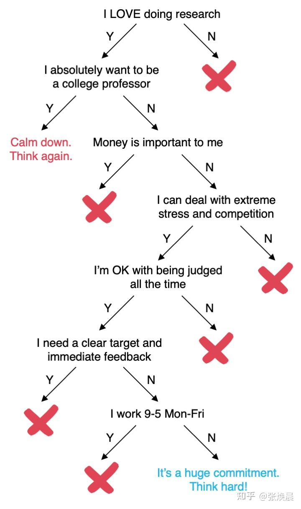

<!--
大家来参加早期科研项目，目的是什么？
我列举了三种可能的目的。
第一是在导师的英明领导下，产出颠覆性的学术成果。这个对大一新生来说可能有亿点难，毕竟不是所有本科生都能在大四的时候发 Nature 一作。
一个有利于你开展研究的心态是：我就是来尝试一下，看看自己几斤几两，来决定我自己是否要从事学术研究。众所周知，在 2026 年，读博只是从事学术研究的必要不充分条件。右图是读博二叉树，用于判断你是否适合读博。
第三种常见的参加早期科研项目的目的是希望混一个论文署名，这样在保研就业的时候你的简历上就会有一篇论文。
我认为以这样的目的来参加科研对你个人是没有任何益处的，具体原因稍后就会展开。
关于参加科研的目的是什么，给大家推荐两篇文章。
其一是南京大学蒋炎岩老师的《给各位（学术圈）天命人的劝退信》，其二是知乎热帖《如何评价长文<我在东五的读研往事>》。
 -->

### 为什么要选题

<!-- _class: bq-green -->

选题不是导师给我的吗？

是也不是。

> 一个典型的研究过程
>
> 导师：你读一下这几篇文献，我们来把 A 方法应用到 B 领域中。
> 学生读完之后：我觉得 A 方法不适用于 B 领域，但是我认为 A 方法可能可以解决目前困扰 C 领域的一个问题，我来写个研究方案。
> 几周后，学生：A 方法能够显著解决 C 领域的某问题，性能提高了 xxx/成本降低了 xxx/填补了 xxx 的空白。

**研究的乐趣在于发现并解决问题，而不是接受任务。**

<!--
本次报告的核心内容是选题。
很多同学会问，选题不是导师给的吗？
其实，选题既有导师的引导，也需要学生主动思考。
一个典型的研究过程是这样的：【读 Slide】。
在这个过程中，研究的问题本质上是学生自己发现的，而不是老师指派的。
研究的乐趣在于发现并解决问题，而不是接受任务。
-->

### 选择细分方向要参考平台资源

<!-- _class: cols-2 -->

[CSRanking](https://csrankings.org/) 是一个完全客观的、按照计算机学科顶会论文数量对学术机构进行排名的数据库。

在该数据库中，选取 2016-2026 的数据，南京大学在 AI 领域的五个子领域中：

- Artificial intelligence 排名世界第 1
- Computer vision 排名世界第 9
- Machine learning 排名世界第 4
- Natural language processing 排名世界第 12
- The Web & information retrieval 排名世界第 13

其他学科暂无细分方向的客观排名，可以咨询高年级同学。

<!--
选择细分方向时，平台资源非常重要。
以智能科学与技术专业为例，CSRanking 提供了一个个完全客观的、按照计算机学科顶会论文数量对学术机构进行排名的数据库。
在该数据库中，选取 2016-2026 的数据，南京大学在 AI 领域的五个子领域中都排名世界前列，特别是 Artificial intelligence 排名世界第 1。
至于机器人、集成电路和数字经济等学科，目前还没有客观的排名。至于哪个方向更有潜力，可以咨询高年级同学。
-->

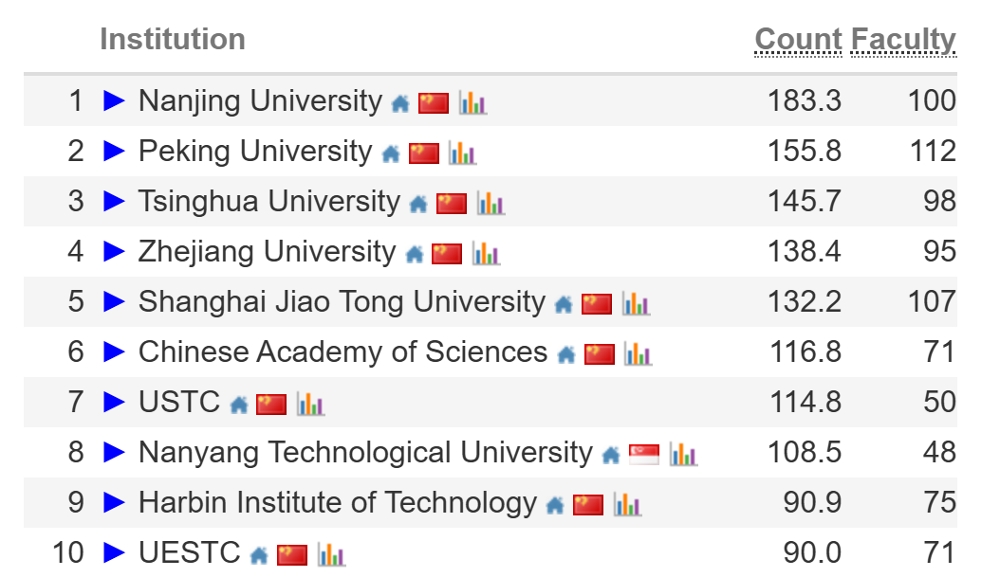

<!-- 
Artificial intelligence 领域世界排名
 -->

<!-- 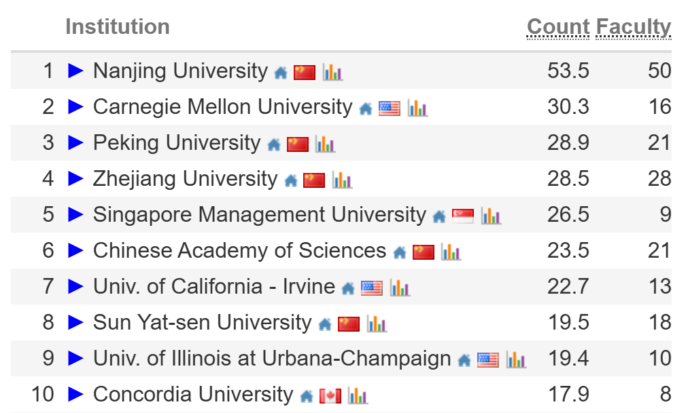 -->

<!-- 
Software engineering 领域世界排名
 -->

## 根据个人禀赋匹配研究范式

<!--
接下来我们进入第一个主题——根据个人禀赋匹配研究范式。
不同学科和方向有各自的研究范式，这直接影响研究内容、方法和评价标准。理解研究范式，有助于我们找到最适合自己的科研道路。
 -->

<!-- _class: trans -->

### 研究范式

研究范式（research paradigm）是指在某一学科或研究共同体中，被广泛接受的一整套关于：

- 研究对象是什么
- 什么问题是“值得研究的”
- 什么方法是“合法的”
- 什么结果算作“知识”
- 如何评价研究质量

的基本假设、方法体系与价值标准的集合。

例如，自然科学通过控制变量等手段，在特定实验环境下进行可复现的实验，研究自变量和因变量的关系；而宏观经济学通过研究历史经济数据，利用统计学模型获得变量间的相关性，并通过适当的经济学理论推断变量间的因果关系。

<!--
读 Slides。
 -->

### 同一学科内不同细分方向的研究范式大相径庭

以智能科学与技术四个典型细分方向为例：

- **机器学习**：经验主义与工程驱动，强调数据规模与算法创新
- **知识表示与推理**：形式化与逻辑主义，追求理论严密性与可证明性
- **类脑智能**：跨自然科学范式，融合神经生物学与计算模型
- **人机交互**：社会科学与心理学范式，重视用户体验与实验设计

这些范式在**研究方法、验证标准、成果评价和人才特质要求**上差异巨大。

<!--
即使在同一学科内，不同细分方向的研究范式也可能截然不同。
读 Slide。
接下来我将给每个方向举具体的例子展示其研究范式。
-->

### 机器学习方向：经验主义与工程驱动范式

- 研究对象：大规模数据集与统计模型
- 核心问题：如何在数据上获得更低的 error、更高的 accuracy、更好的 generalization
- 方法论（Methodology）：
    - 数学建模（概率论、优化理论、信息论）
    - 算法设计（SGD、Transformer、Diffusion Model 等）
    - 大规模实验对比（benchmark 驱动）
- 实验范式：
    - 标准数据集（ImageNet、COCO、GLUE 等）
    - 可复现实验
    - 定量指标（Accuracy、F1、BLEU、Perplexity）
    - 成果评价标准：
        - 是否在 benchmark 上超过 SOTA（State-of-the-art，最优解）
        - 是否提出新的模型结构或训练方法

<!--
机器学习方向以大规模数据和统计模型为核心，追求更低的错误率、更高的准确率和更好的泛化能力。
研究方法包括数学建模、算法设计和大规模实验。
成果评价标准主要看是否在 benchmark 上超越 SOTA，是否提出新模型或训练方法。
-->

### **NIPS'17-Attention Is All You Need**

<!-- _class: cols-2-37 -->

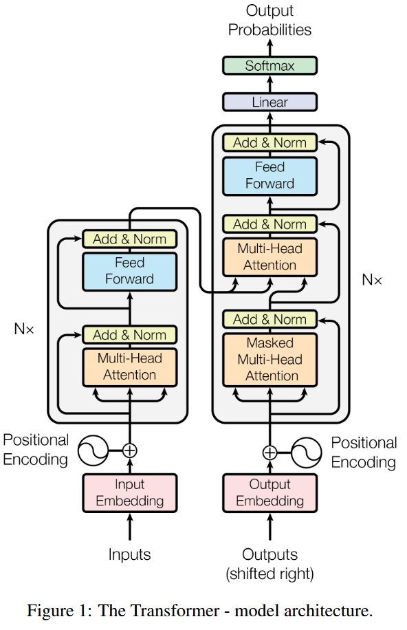

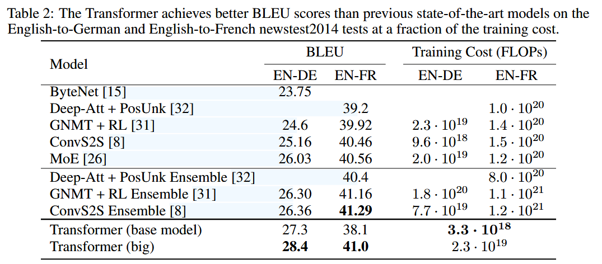

- 在英-德翻译任务中，Transformer 得分超过了 SOTA；
- 在英-法翻译任务中，Transformer 得分接近 SOTA；
- 在训练成本上，Transformer 的基础模型和大模型比 SOTA 分别低了 3 个和 2 个数量级。

<!--
“Attention Is All You Need”这是在人工智能领域影响非常深远的一篇论文，于 2017 年发表在顶会 NIPS 上。
左图是本文提出的一种基于注意力 Attention 机制的自然语言处理架构 Transformer；
右图展示了 Transformer 的性能测试结果。
【读 Slide】
本文的理论和实践极大推动了自然语言处理的发展。其成功不仅在于创新的结构设计，更在于系统的工程优化和大规模实验验证。
-->

### 知识表示与推理方向：形式化与逻辑主义范式

<!-- _class: cols-2-64 -->

- 研究对象：符号系统、逻辑语言、推理规则
- 核心问题：
    - 知识如何被形式化表达？
    - 推理系统是否 sound / complete？
    - 推理复杂度是多少？
- 方法论：
    - 一阶逻辑、描述逻辑、模态逻辑
    - 形式化语义与证明系统
    - 计算复杂性分析（NP-hard、PSPACE-complete 等）

- 实验范式：
    - 定理证明（proof）
    - 反例构造
    - 算法复杂度分析
- 成果评价标准：
    - 是否给出严格定理与证明
    - 是否改进理论复杂度界
    - 是否提出新的逻辑系统或语义框架

<!--
知识表示与推理方向强调符号系统和逻辑推理，关注理论的严密性和可证明性。
研究方法包括一阶逻辑、描述逻辑等，成果评价看是否有严格定理和复杂度改进。这种研究方式适合喜欢理论和抽象思维的同学。
 -->

### **KR'24-Counterfactual and Semifactual Explanations in Abstract Argumentation: Formal Foundations, Complexity and Computation**

<!-- _class: cols-2 -->

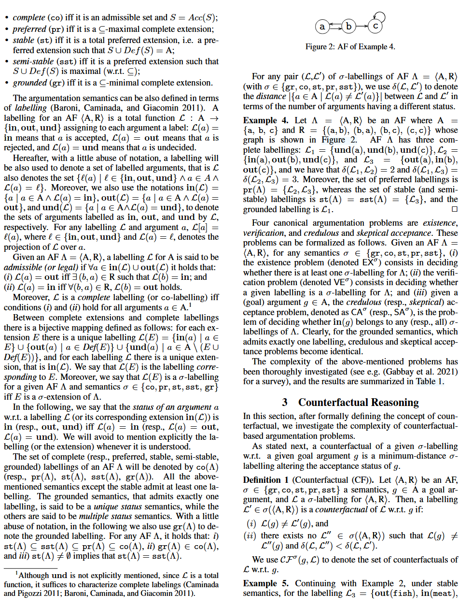

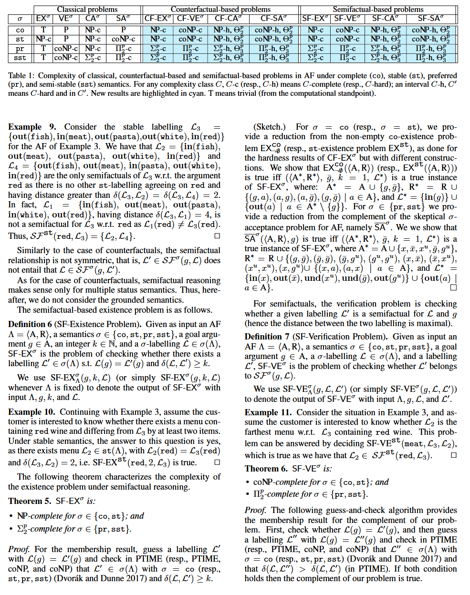

<!--
这篇发表在 2024 年 KR 会议上的文章是一篇典型的形式化研究。
这类论文通常聚焦于形式化理论和复杂度分析，通过严密的证明推动领域进步。
随便翻几页就会发现这篇文章里面充满了看不懂的公式和希腊字母，有兴趣的同学可以自己去借助 AI 看一下这篇文章在讲什么。
-->

### 类脑智能方向：跨自然科学范式

<!-- _class: cols-2-64 -->

- 研究对象：生物神经系统与神经动力学模型
- 核心问题：
    - 大脑如何实现学习与记忆？
    - 神经元放电模式如何编码信息？
    - 生物机制如何启发人工模型？
- 方法论：
    - 神经动力学方程
    - 生物实验数据分析（EEG、fMRI、spike trains）
    - 计算模型仿真

- 实验范式：
    - 生物实验与计算实验并行
    - 假设—验证式研究
    - 小样本、高噪声数据
- 成果评价标准：
    - 是否解释生物现象
    - 是否与神经科学实验一致
    - 是否提出可验证假说

<!--
类脑智能方向融合了神经科学和计算模型，研究大脑学习与记忆机制。
方法包括神经动力学建模和生物实验数据分析。
成果评价看是否解释生物现象、提出可验证假说。
适合对交叉学科感兴趣的同学。
 -->

### **Neural Networks'25-CS-QCFS Bridging the performance gap in ultra-low latency spiking neural networks**

<!-- _class: cols-2 -->

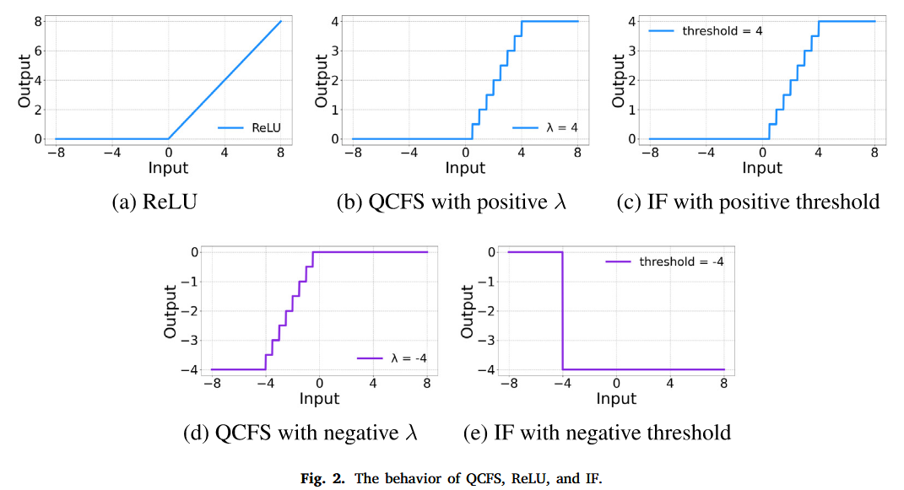

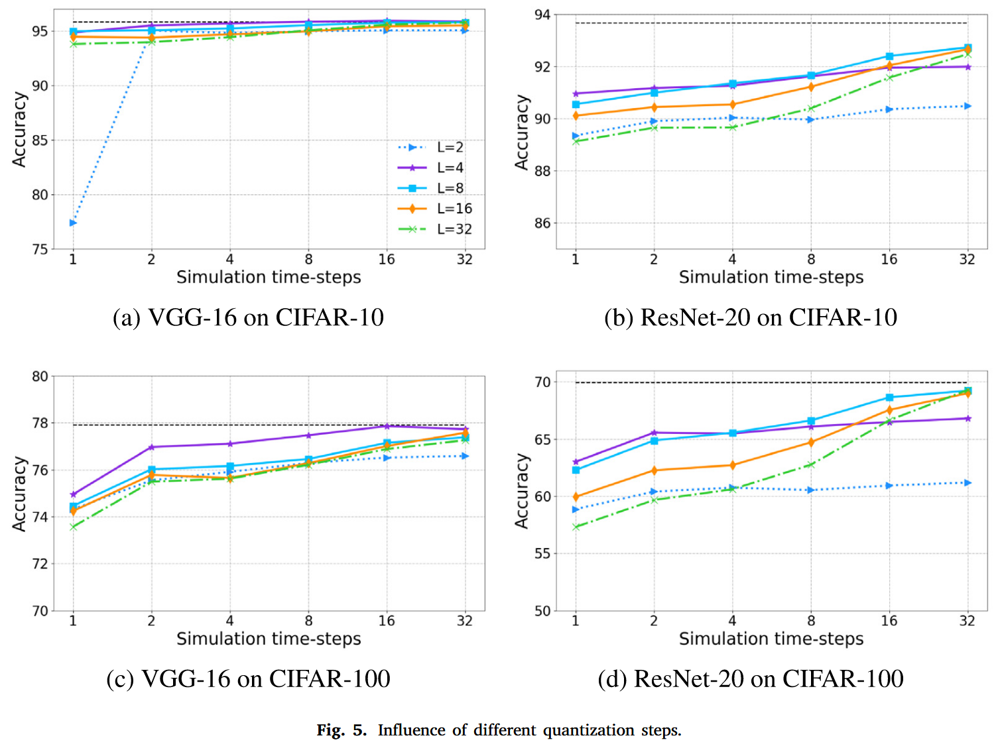

<!--
脉冲神经网络（SNN）处于计算神经科学的前沿，能够模拟生物系统的微妙动态。
本文提出 CS-QCFS 激活函数，通过解决通道异质性和负阈值问题，克服了 ANN-SNN 转换中延迟高的缺陷。该方法在极短时间步下性能卓越，仅需 1 个时间步即可在 CIFAR-10/100 上达到 SOTA 准确率。
-->

### 人机交互方向：社会科学与实验心理学范式

<!-- _class: cols-2 -->

- 研究对象：人类用户行为与认知过程
- 核心问题：
    - 系统是否可用（usability）？
    - 用户是否理解模型决策？
    - 交互是否降低认知负担？
- 方法论：
    - 用户实验设计（A/B test）
    - 问卷与统计分析
    - 定性访谈与行为编码

- 实验范式：
    - 小样本受试者实验
    - 对照组与统计显著性检验（p-value, confidence interval）
    - IRB / 伦理审查
- 成果评价标准：
    - 是否具有统计显著性
    - 是否改善用户体验
    - 是否符合伦理与社会价值

<!--
人机交互方向强调用户体验和实验设计，采用问卷、访谈等社会科学方法。
成果评价看是否改善用户体验、具有统计显著性。
适合喜欢与人打交道、关注实际应用的同学。
-->

### **CHI'19-Guidelines for Human-AI Interaction**

<!-- _class: cols-2 -->

该研究旨在解决人工智能系统（AI-infused systems）因其不确定性、不可预测性和演化性而给用户界面设计带来的独特挑战。

研究人员通过综合过去 20 年间学术界和工业界的 150 多项建议，总结并验证了 18 条通用设计准则。

例如：

- G2: Make clear how well the system can do what it can do. Help the user understand how often the AI system may make mistakes.
- G4: Show contextually relevant information. Display information relevant to the user’s current task and environment.

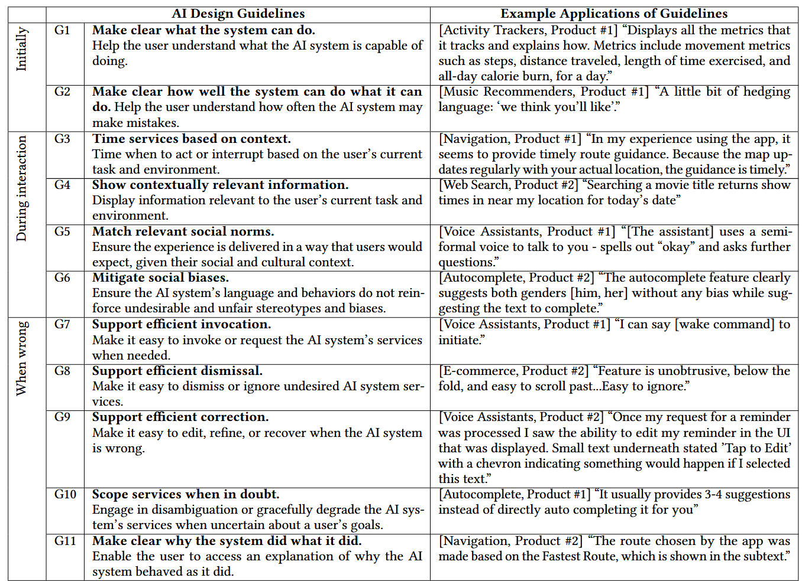

<!--
这篇发表在人机交互顶会 CHI 上的论文提出了 18 条关于人类-AI 交互的通用设计准则。
例如：
G2：明确系统能做什么、能做到什么程度。
G4：提供上下文相关信息，展示与用户当前任务和环境相关的信息。
 -->

### 研究范式直接决定了研究者需要的核心素质

**机器学习（工程驱动）**

- 关键：巧妙的想法 + 系统的工程优化
- 例：Transformer 的核心想法（多头自注意力）很简洁，但论文成功在于细致的超参数设计与大规模实验验证
- 研究者可部分被自动化搜索（AutoML）和 scaling law 替代

**知识表示与推理（理论深度）**

- 关键：严密的数学思维与对问题的深入理解
- 例：Calvanese 等人关于 OWL 本体查询复杂度的工作，核心来自对描述逻辑理论的深刻洞察
- 研究者需要提出启发式的转换规则并证明其正确性，目前不存在形式逻辑上可靠的 AI

> 研究 PL （程序设计语言）需要你既懂数学，又懂计算机；而研究 AI 你可以既不懂数学，也不懂计算机。

<!--
不同研究范式对研究者素质要求不同。
【读 Slide】
软件学院某教授曾经锐评本组的招生情况：我们组每年都要招一个非计算机科班的研究生，还要招一个双非本科的研究生，就是为了说明，研究我们这个方向，你可以既不懂数学，也不懂计算机。
 -->

### 研究范式直接决定了研究者在项目中的地位

<!-- _class: cols-2 -->

- 有些课题需要昂贵的研究设备和操作设备的傻瓜

冷冻电镜（Cryo-EM）单台设备价格数百万美元。论文创新点一般是：**我们首次解析了蛋白 X 的三维结构（分辨率 3.2 Å），与已知 Y 蛋白结构高度相似。**

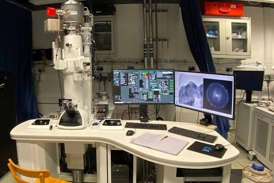

- 有些课题需要一沓草稿纸和一个聪明的脑瓜

纽约大学王虹（Hong Wang）与其合作者 Larry Guth 通过引入多项式分层法（Polynomial Partitioning），证明了**三维挂谷集合的 Minkowski 维数必须等于 3**。

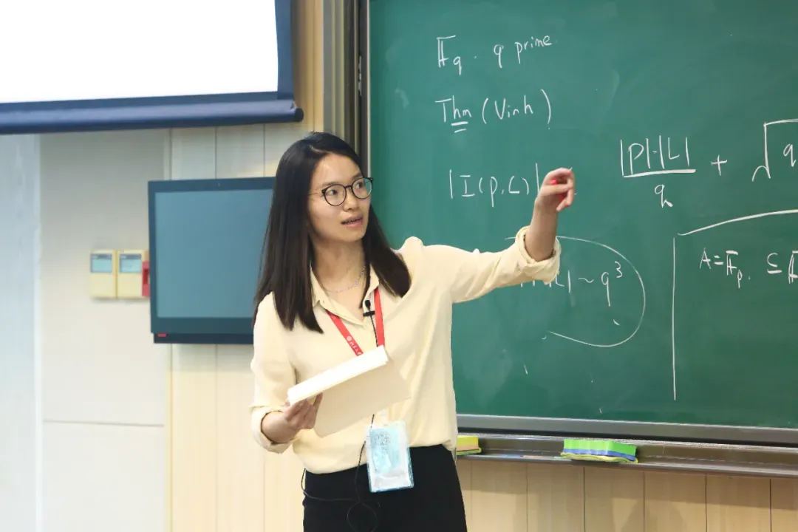

<!--
不同的研究范式直接决定了研究者在项目中的地位。
我将其概括为：
- 有些课题需要昂贵的研究设备和操作设备的傻瓜
- 有些课题需要一沓草稿纸和一个聪明的脑瓜
前者典型的例子是生物医学领域的冷冻电镜，其单台设备价格数百万美元。
如果一个学校购入了一台冷冻电镜，整个学校和化学、生物、医学相关的课题组都要来蹭设备，短短几年论文发表量就能上一个台阶。
这些论文的创新点一般是：**我们首次解析了蛋白 X 的三维结构（分辨率 3.2 Å），与已知 Y 蛋白结构高度相似。**
我个人认为，相比于科技创新，这些论文更像是实验报告。
而后者的典型案例是数学、理论物理学和计算机科学理论。
去年非常火的王虹解决了三维挂谷猜想问题，并在国内各个高校作报告，这些视频目前在 B 站还能找到，63 分钟的视频我只能听懂前 30 分钟。很多人预测王虹可能是下一个菲尔兹奖获得者。
 -->

## 根据个人兴趣选择研究范式

<!--
TODO
 -->

<!-- _class: trans -->

### 研究范式与研究成果的可信度高度相关

<!-- _class: footnote -->

在工程驱动的 AI 领域的研究中：

- 大多数高引用论文实验无法复现或复现结论不符$^1$；
- 大量论文中存在数据泄露等学术舞弊$^2$；
- AI 幻觉在投稿论文中屡见不鲜，同行评审并未检出$^3$；

1. Gundersen, O. E., Cappelen, O., Mølna, M., & Nilsen, N. G. (2025). The Unreasonable Effectiveness of Open Science in AI: A Replication Study. Proceedings of the AAAI Conference on Artificial Intelligence, 39(25), 26211–26219. https://doi.org/10.1609/aaai.v39i25.34818
2. Kapoor, S., & Narayanan, A. (2023). Leakage and the Reproducibility Crisis in Machine-Learning-Based Science. Patterns, 4(9), 100804. https://doi.org/10.1016/j.patter.2023.100804
3. GPTZero Team. (2026, January). GPTZero Finds 100 New Hallucinations in NeurIPS 2025 Accepted Papers. AI Detection Resources | GPTZero. https://gptzero.me/news/neurips/

<!--
不同的研究范式与研究成果的可信度高度相关。
以工程驱动的 AI 领域研究为例，我这里简要列举三条：
【读 Slide】
 -->

### **AAAI'25-The Unreasonable Effectiveness of Open Science in AI**

<!-- _class: cols-2-46 -->

本文系统性地尝试复现 30 篇高引用 AI 论文，其中：

- 有 8 篇依赖于特定数据和硬件，因此读者无法不可能复现；
- 成功复现结论（S）：6 篇；
- 部分成功复现结论（PS）：5 篇；
- 复现实验失败（F）：6 篇；
- 复现完成，结论不符（NR）：5 篇；

换言之，绝大多数的 AI 论文其结论无法被证实。

<!--
发表在 AAAI 2025 上的这项研究【读 Slide】
 -->

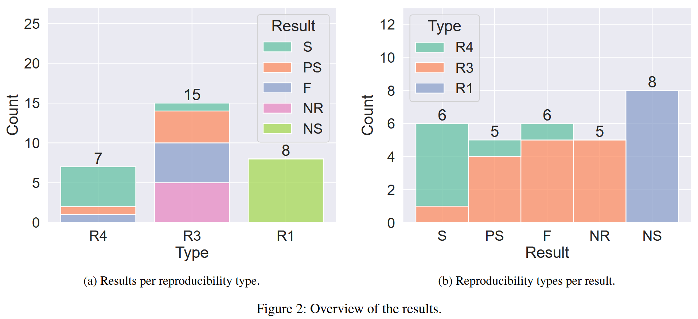

### **Patterns'23-Leakage and the reproducibility crisis in machine-learning-based science**

<!-- _class: cols-2 -->

**数据泄露**是指用于测试模型性能的关键数据以某种方式泄漏给模型，是严重的学术舞弊。

例如：南信大《数字电子技术》任课老师把期末考试卷和往年卷一起发给同学们训练，导致同学们在上考场之前就见过考试题。

本文对 17 个科学领域（包括医学、社会科学等）的 22 篇综述论文进行分析，发现数据泄漏至少影响了 294 篇论文。在**所有案例**中，数据泄漏都导致了虚假的乐观结论。

修复泄漏后，复杂机器学习模型的表现并不实质性优于几十年前的传统逻辑回归模型。

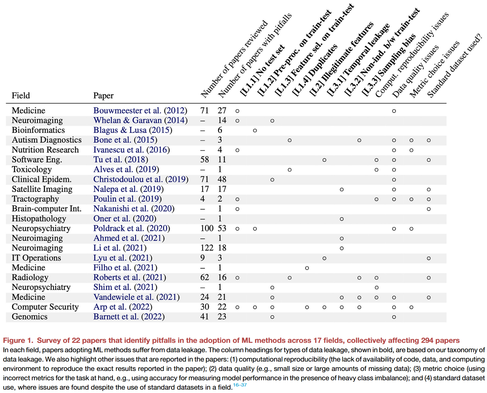

<!--
【读 Slide】
-->

### **GPTZero finds 100 new hallucinations in NeurIPS 2025 accepted papers**

<!-- _class: cols-2 -->

GPTZero 对 AI 顶会 NIPS'25 发表的 4841 论文进行扫描，发现其中 51 篇论文共包含至少 100 处虚假的幻觉引用，包括但不限于：

- 初级错误：参考文献中直接出现占位符姓名，或引用链接指向 example.com 和 404 页面；
- 中级错误：引用的论文作者、年份、期卷号或 DOI 被 AI 随机篡改；
- 高级伪造：这些文献在现实世界中完全不存在。

GPTZero 同样对另一个 AI 顶会 ICLR 发起了调查，结论类似：GPTZero finds over 50 new hallucinations in ICLR 2026 submissions。

<!-- 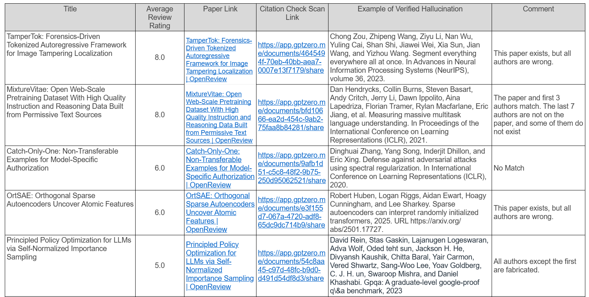 -->

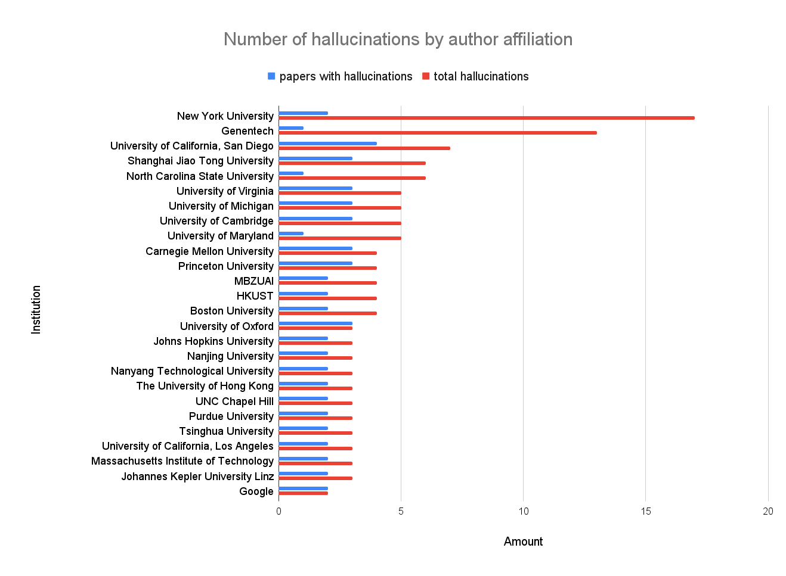

<!--
【读 Slide】
注意上文提到的 NIPS 和 ICLR 都是 CCF-A 类会议，也是各个领域的顶级会议。
这些会议的论文质量泥沙俱下，与这个领域的研究范式是分不开的。
 -->

### 研究范式直接决定研究方向的热门程度和泡沫程度

<!-- _class: cols-2-46 -->

- AI 8 大顶会一年接受论文 15000+ 篇；
- TCS 5 大顶会一年接受论文仅几百篇；

东南沿海某 985：

> 1篇网络安全A会=12篇人工智能A会

软件学院某副教授：

> 1 PLDI = 2 ICSE = 20 CVPR

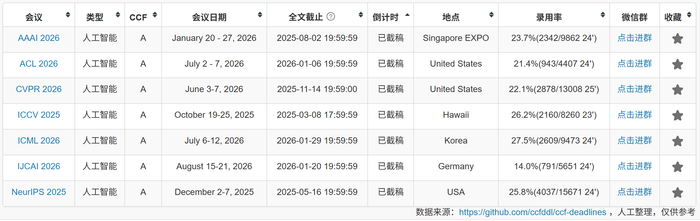
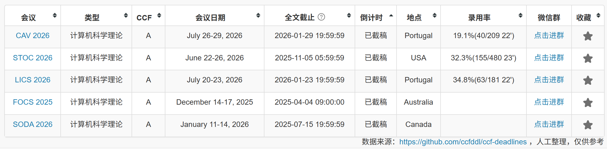

<!--
AI 毫无疑问是当下计算机学科最火热的研究方向，但是这种火热之下掩藏着极大的学术泡沫。
不同研究范式下，成果产出的难度和数量差异很大。
在计算机学科中，人工智能方向的 8 大顶会再过去一年中总共收到了超过 66000 份投稿，接受了其中的 15000 多篇论文。
大量低质量的投稿实际上挤占了审稿人的时间和精力，导致本来很水的文章也有可能侥幸通过同行评审并被录用。而面对海量的投稿，审稿人根本没时间关注实验结果到底能不能复现，有些不负责任的审稿人甚至直接使用 AI 进行审稿。
与之相反，计算机科学理论方向每年录用的论文加起来只有几百篇，比 AI 领域少了两个数量级。
面对这种发文难度的数量级差距，东南沿海某 985 高校对教师进行成果考核时，提出了
1篇网络安全A会=12篇人工智能A会的换算方式。
而软件学院某副教授也曾在组会上发表观点：1 PLDI = 2 ICSE = 20 CVPR。
 -->

### 研究范式直接决定研究方向的热门程度和泡沫程度

<!-- _class: cols-3 -->

- “论文辅导、保证中稿”的代写服务大行其道，**所有论文工厂**集中在 AI 领域；
- 从未见过计算机科学、操作系统、程序设计语言领域的代写服务。

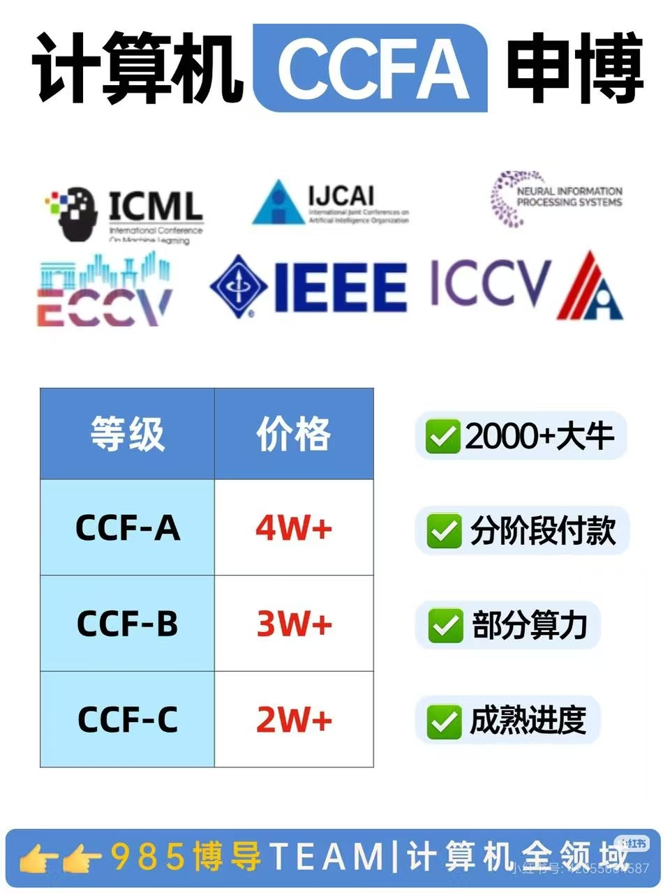

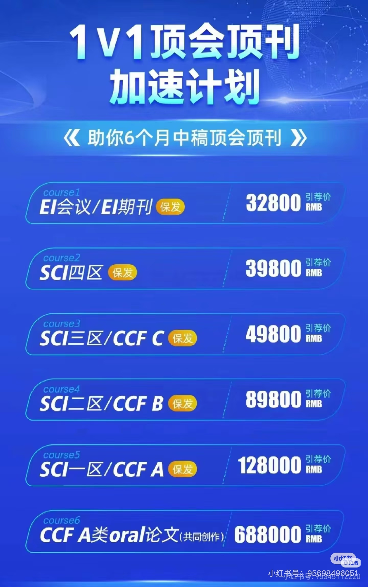

<!--
在小红书或者淘宝上搜索计算机顶会论文辅导，会看到明码标价的“论文辅导、保证中稿”广告。其实稍微接触就知道，所谓的论文辅导就是论文工厂替你写论文。既不需要你做实验，也不需要你写论文，只需要提供你的姓名和邮箱。
不难想象，你能找到的所有论文代写，承诺保证中稿的领域都集中在 AI 领域。
我从未见过哪个论文工厂敢碰瓷计算机科学或者操作系统领域的。
如果你为了升学或者毕业要找论文代写，我拦不住你。但你千万别说是南京大学健雄书院的，我听了都丢人。
 -->

## 科研工作者如何面对 AI 时代

<!--
进入 AI 时代，科研工作者面临新的挑战和机遇。
几乎各行各业的人都在说，我的工作 AI 完全可以胜任，我马上就要失业了！
接下来我想和大家讨论一下，科研工作者如何面对 AI 时代。
 -->

<!-- _class: trans -->

### **Science'24-GPTs are GPTs: Labor market impact potential of LLMs**

<!-- _class: cols-2 -->

该研究建立了一个新的评估标准，结合人类专家和 GPT-4 的分类，评估了 GPT 对美国各职业任务的影响，用暴露值（Exposure）表示这一影响。主要结论包括：

- 约 80% 的劳动力暴露值超过 10%；
- 约 19% 的劳动者暴露值超过 50%；
- 高薪职位和需要高级技能、受教育程度较高的职业（如程序员、律师）暴露值更高；
- GPT 展现出了通用技术（General-Purpose Technologies, GPTs）的特征，意味着其影响将是深远且跨行业的。

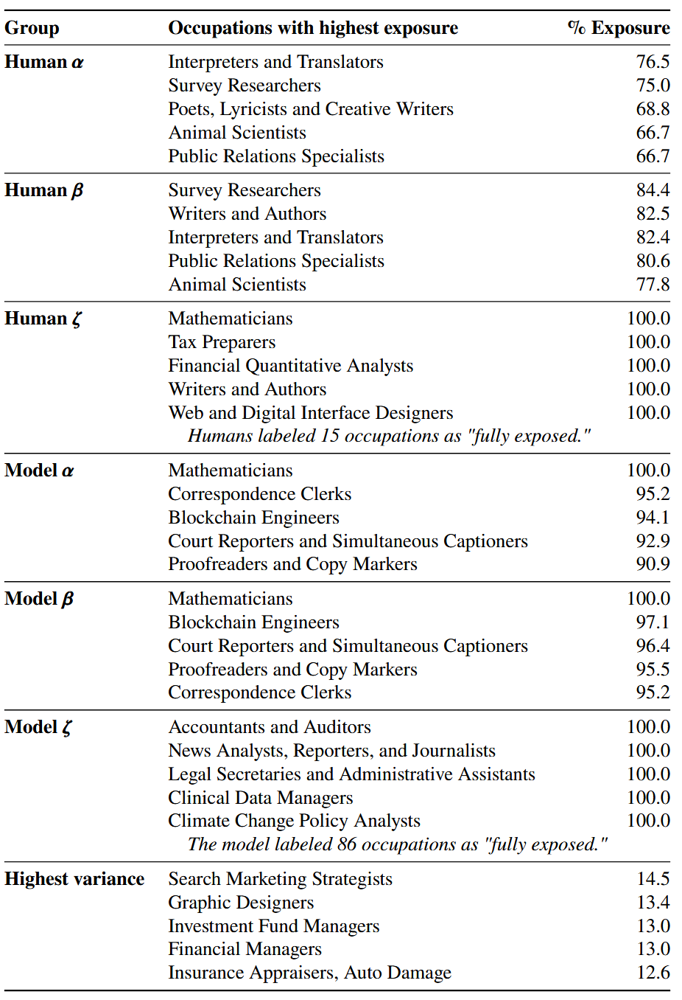

<!--
这是一份刊登在 Science 期刊上的研究。
【读 Slide】
-->

### **Science'24-GPTs are GPTs Labor market impact potential of LLMs**

<!-- _class: cols-2 -->

34 个与物理世界交互的职业暴露值为 0，包括：

- 运动员和体育竞技者；
- 汽车玻璃安装工和修理工；
- 公共汽车和卡车机械师及柴油发动机专家；
- 水泥工和混凝土抹光工；
- 厨师；
- 电力线路安装工和维修工；
- 挖掘和装载机及拉铲操作员、露天采矿；
- 铸造模具和制芯工；
- 砖瓦工、砌块工、石匠、瓷砖和大理石铺设工的助手；
- 肉类、家禽和鱼类切割工和修整工；
- 金属轨道铺设和维护设备操作员；

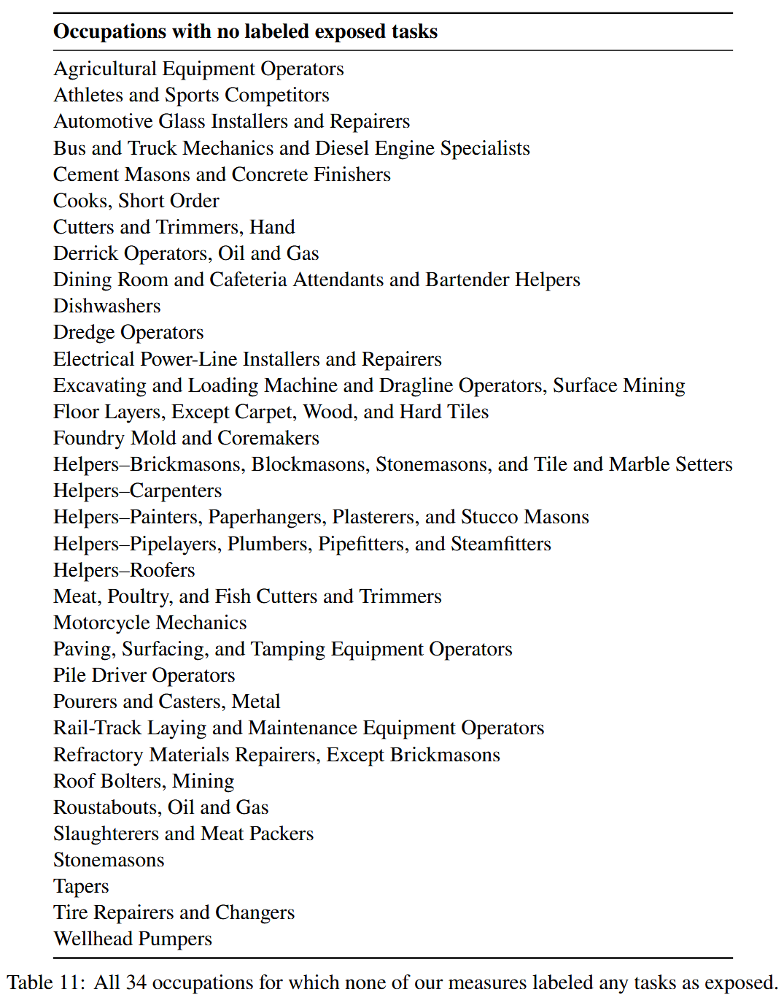

### AI 职业替代风险评估矩阵

<!-- _class: cols-2-73 -->

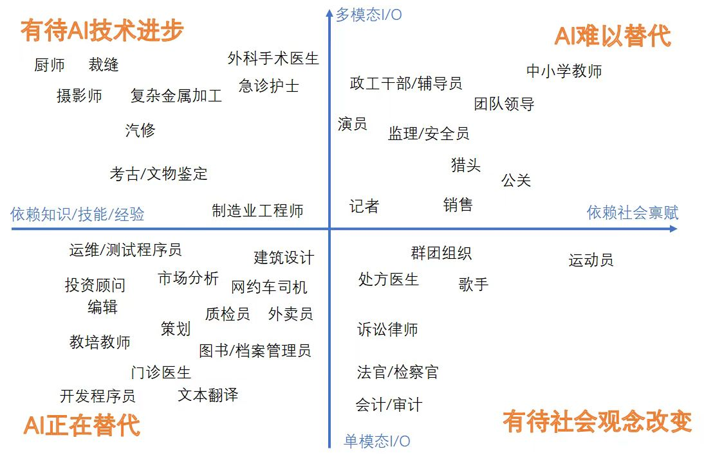

<!--
关于什么样的职业更容易被 AI 取代，我专门写了一篇博客文章来论述。右边是精简版的的小红书二维码，可以直接扫码查看。
本文的核心结论如图所示。
左侧是依赖知识/技能/经验的职业，右侧是依赖社会禀赋的职业，左侧比右侧更容易用 AI 来完成工作；
下方是进行文本/代码/数据/图像处理的职业，上方是依靠人的自然属性（眼耳鼻舌身）与物理世界交互的职业，下方比上方更容易用 AI 完成。

- 开发程序员
- 厨师和裁缝：机械臂成熟后或许可以替代
- 处方医生：如果你足够相信 AI，你就可以按照 AI 给的药方吃药
- 中小学教师：在教学能力之外，需要共情能力，需要获得学生信任
-->

### 业界需求决定研究意义？

<!-- _class: cols-2-64 -->

1. 基础理论的研究并不直接对应业界需求，但对学科发展意义重大；
    - 在 18、19 世纪，数论被公认为数学中最纯粹、最“没用”的分支。但大整数理论构成了 1970s 诞生的 RSA 加密算法的理论基础，该算法是全球的互联网安全、银行交易和军事通信的核心原理。
2. 业界需求可随研究成果而改变；
    - 晶体管出现前，业界对“便携式计算”或“智能手机”毫无需求。但当半导体研究成果落地后，业界的需求从“修真空管”彻底转向了“集成电路设计”、“软件开发”和“移动互联网”。

> 在汽车出现前，人们想要的是一匹更快的马。
>
> 
——亨利·福特

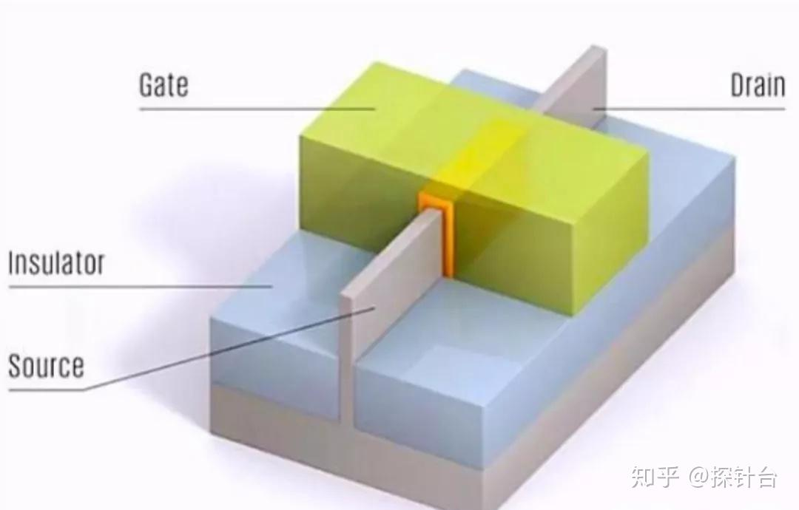

<!--
我以上的部分表面上是在批判 AI 研究中的乱象，制造了 AI 会代替工作的焦虑。
实际上是希望大家能在了解各种现实之后，透过乱象看到本质，多思考一下自己为什么要做研究、适合做什么样的研究。
有人会说，这样水出来的论文是没有意义的，因为产业界不需要。
我觉得也不一定对。
【读 Slide】
 -->

### 研究的意义感

研究意义 ≠ 研究的意义感

> 在共产主义社会高级阶段，劳动已经**不仅仅是**谋生的手段，而是本身成了生活的第一需要。
>
> 
——马克思《哥达纲领批判》

在 2026 年，绝大多数的脑力劳动已经**无法成为**谋生的手段，因此不作为生活需要的劳动失去了存在的意义。

在接下来的几年，水论文将无法成为谋生、就业、升学的手段，因此**没有研究难度、没有研究价值的水论文将失去存在的意义**。

<!--
我们刚刚讨论了研究意义的问题，但作为深度参与研究项目本身的研究者，我更推荐大家关注研究的意义感。
这是一个纯主观的感受，它体现在你是否愿意沉浸其中甚至废寝忘食，能够连续几个月把大量的时间和精力投入到同一个问题当中并且乐在其中。
如果你能做到这点，那么你的研究是否有客观的现实意义就不再重要了。
正如马克思在《哥达纲领批判》中的预言，“在共产主义社会高级阶段，劳动已经不仅仅是谋生的手段，而是本身成了生活的第一需要”。
前不久，我和智软院党委武书记讨论到工作意义的问题。武书记认为，马克思所描述的这种社会形态并非遥不可及，甚至在很多行业已经实现。
很多行业的就业现实是，绝大多数的脑力劳动已经无法成为谋生的手段，因此不作为生活需要的劳动失去了存在的意义。
在可以预见的将来，水论文也将无法成为谋生、就业、升学的手段，因此没有研究难度、没有研究价值的水论文将失去存在的意义。
 -->

## 什么是“难而正确的事”？

- 难：
    - 需要克服困难去做；
    - 你能做，别人不能，AI 也不能；
- 正确：
    - 有意义感，有正反馈，能够自得其乐；
    - 不因简单而喜欢，不因短平快而浮躁；

<!--
至此，我们再回到本次报告的主题。
什么是“难而正确的事”？
所谓“难”，就是你需要克服重重困难才能做到的，你能做而别人不能的，不能轻易被 AI 取代的；
所谓“正确”，就是对你有意义感的，你能够从中获得及时的正反馈，能够自得其乐；
千万千万不要因为一个方向简单、容易出成果就轻易选择。
 -->

---

<!-- _class: lastpage -->
<!-- _footer: "" -->

###### 桐花万里丹山路，雏凤清于老凤声

<!-- 感谢大家的聆听，欢迎交流与提问。祝大家科研顺利，前程似锦！ -->

<!-- 

幻灯片: https://ryani.org/assets/talks/perf.pdf

 -->
